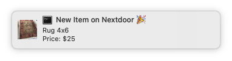

# Instant, Local Notifications for Nextdoor.

In my humble opinion, Nextdoor is by far the best place for finding the best deals on neighbors selling _stuff_. It beats out Facebook Marketplace and Craigslist due to the trust that comes with being a part of a neighborhood.

This project's goal is to help make deals **as fast as possible**. This little project checks Nextdoor classifieds every minute for a new product and then sends a notification on your computer with details.

_in active development_

## Installation

1. Clone this repo to your computer
2. Change `example.constants.js` to `constants.js` and add in your Nextdoor email and password.
3. More coming soon.

## Todo
- [ ] One time account login happens where code gets sent to the email address. Not sure how often/when/how to handle. [07/14/2020]
    -- Create steps for initialize.js
    -- Create webpage with instructions
- [ ] When a price drops, it is wrapped in a "" [07/16/2020]
- [ ] Add timestamp to logs [07/16/2020]
